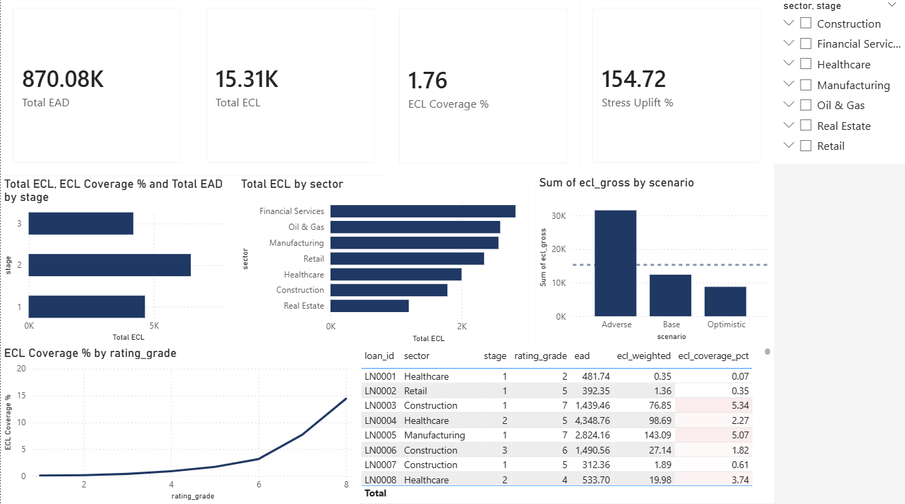

# ECL Stress Testing Model — IFRS 9 Compliant

A portfolio-level Expected Credit Loss (ECL) stress testing model built in Python, with a Power BI dashboard for management reporting. Designed to reflect the forward-looking, probability-weighted ECL framework required under IFRS 9.

---

## Overview

This project simulates the end-to-end ECL computation workflow used in banking credit risk functions, covering:

- Synthetic loan portfolio generation across industry sectors and IFRS 9 stages
- Forward-looking macroeconomic scenario definition using GDP growth and unemployment as key MEVs
- Point-in-time PD estimation via MEV-linked multipliers applied to through-the-cycle base PDs
- ECL computation (PD × LGD × EAD) with IFRS 9 stage-based horizon logic
- Probability-weighted ECL aggregation across three macroeconomic scenarios
- Portfolio analysis by stage, sector, and scenario with stress uplift quantification
- Interactive Power BI dashboard for concentration risk and scenario sensitivity reporting

---

## Background & Motivation

IFRS 9, effective from 2018, replaced the IAS 39 incurred loss model with a forward-looking expected loss framework. The key requirement is that ECL must reflect an unbiased, probability-weighted estimate incorporating forecasts of future economic conditions — not just historical default experience.

This project was built to demonstrate the practical implementation of that framework, drawing on experience in IFRS 9 ECL modelling at Sumitomo Mitsui Banking Corporation and credit risk analysis at RHB Bank.

---

## Project Structure

```
ecl-stress-testing-model/
│
├── step1_portfolio.py          # Synthetic loan portfolio generation
├── step2_scenarios.py          # Macroeconomic scenarios & PD multiplier calculation  
├── step3_ecl_calculation.py    # ECL computation & probability weighting
├── dashboard_preview.png       # Power BI dashboard screenshot
└── README.md
```

Run the scripts in order (Step 1 → 2 → 3). Each script saves a CSV that the next step reads as input.

---

## Methodology

### 1. Portfolio Generation (Step 1)

A synthetic portfolio of 500 corporate and SME loans is generated with the following attributes:

| Attribute | Description |
|---|---|
| Sector | 7 industry sectors (Oil & Gas, Real Estate, Manufacturing, etc.) |
| IFRS 9 Stage | Stage 1 (70%), Stage 2 (20%), Stage 3 (10%) |
| EAD | Log-normally distributed exposure (RM thousands) |
| Rating Grade | Internal rating scale 1–8 (1 = best, 8 = worst) |
| Tenor | Remaining loan life, 0.5–7 years |
| Collateral Ratio | 0.0 (unsecured) to 1.5x (over-collateralised) |
| LGD | Derived from collateral ratio, floored at 10%, capped at 90% |

### 2. Macroeconomic Scenarios & Forward-Looking PD (Step 2)

Three scenarios are defined using GDP growth and unemployment as macroeconomic variables (MEVs), consistent with BNM IFRS 9 guidance on forward-looking information:

| Scenario | Probability | GDP Growth | Unemployment |
|---|---|---|---|
| Optimistic | 25% | +4.5% | 3.2% |
| Base | 55% | +2.8% | 4.1% |
| Adverse | 20% | -1.5% | 7.0% |

Through-the-cycle (TTC) base PDs by rating grade are converted to point-in-time (PIT) PDs using a scenario multiplier derived from MEV deviations:

```
multiplier = exp((base_GDP - scenario_GDP) × 0.15 + (scenario_unemployment - base_unemployment) × 0.10)
```

The exponential form ensures PDs remain bounded between 0 and 1 and reflects the non-linear nature of credit deterioration under stress.

### 3. ECL Calculation & Probability Weighting (Step 3)

ECL is computed for each loan under each scenario using:

```
ECL = PD_scenario × LGD × EAD × ECL_horizon
```

Where ECL horizon follows IFRS 9 stage logic:
- **Stage 1:** 12-month horizon (capped at 1 year)
- **Stage 2 & 3:** Lifetime horizon (full remaining tenor)

The stage-based horizon is what produces the IFRS 9 cliff effect — a loan migrating from Stage 1 to Stage 2 can see ECL increase several times over purely from the horizon extension, before any PD deterioration is applied.

Probability-weighted ECL per loan:

```
ECL_weighted = (ECL_optimistic × 0.25) + (ECL_base × 0.55) + (ECL_adverse × 0.20)
```

---

## Key Outputs

### Portfolio ECL Summary

| Metric | Value |
|---|---|
| Total EAD | RM870.08K |
| Base Scenario ECL | RM12.38K |
| Adverse Scenario ECL | RM31.53K |
| Probability-Weighted ECL | RM15.31K |
| ECL Coverage Ratio | 1.76% |
| Stress Uplift (Adverse vs Base) | 154.72% |

*Run the scripts to populate these figures.*

### Power BI Dashboard



The dashboard provides:
- KPI headline cards (EAD, weighted ECL, coverage ratio, stress uplift)
- ECL by IFRS 9 stage — regulatory staging view
- ECL by sector — concentration risk view
- Scenario comparison chart with probability-weighted ECL reference line
- Coverage ratio by internal rating grade — model integrity view
- Loan-level detail table with conditional formatting

Interactive slicers allow drill-down by sector, stage, and rating grade across all visuals simultaneously.

---

## Technical Requirements

```
Python 3.9+
pandas
numpy
```

Install dependencies:
```bash
pip install pandas numpy
```

Power BI Desktop (free) required for dashboard — download at microsoft.com/en-us/power-bi

---

## Concepts Demonstrated

- IFRS 9 ECL framework (PD, LGD, EAD, staging, lifetime vs 12-month horizon)
- Forward-looking macroeconomic scenario construction
- MEV selection and point-in-time PD conversion
- Probability-weighted ECL aggregation
- Stress testing and scenario sensitivity analysis
- Concentration risk reporting by sector
- Portfolio credit risk dashboard design in Power BI

---

## Author

**Oliver Edward Theseira**  
Credit Risk & ECL Modelling | Python | R | SQL | VBA | Power BI  
[LinkedIn](http://my.linkedin.com/in/olivertheseira) · olivertheseira@gmail.com
